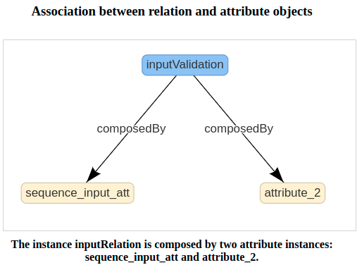
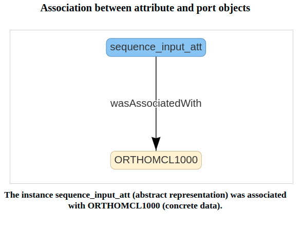

# MAESTRO

<a href="https://sol.sbc.org.br/index.php/sbbd/article/view/25532">MAESTRO: An Approach for Composing and Analyzing Script-Based Workflows through Ontologies.</a>

## Prerequisites

- Python3
- Conda
- Java
- Monetdb
- DfAnalyzer 
- Dfa-lib-python

The application was developed in Ubuntu:

```
Distributor ID:	Ubuntu
Description:	Ubuntu 22.04.3 LTS
Release:	22.04
Codename:	jammy
```

To list ubuntu release:

```
lsb_release -a
```


## Installation of Dependencies

Before running the project, you must install the Python dependencies specified in the "requirements.txt" file in a virtual env. To do this, run the following command in the terminal:

```
conda create --name maestro
```

To list all env:

```
conda env list
```
To active de env:

```
conda activate maestro
```

Now, to install the requirements:

```
pip3 install -r requirements.txt

```
## Installation of Dfa-lib-python
Dfa-lib-python is a Python package used to send provenance data to DfAnalyzer tool. To install Dfa-lib-python:

```
cd library
cd dfa-lib-python
python3 setup.py install

```

## Approach Steps

## 1. Workflow Specification

The first step of the approach is the specification of the experiment according to the concepts of experiment lines. The specification is done in the main.py file. The example present in the repository is about the application - <a href="https://sol.sbc.org.br/index.php/bresci/article/view/25492">NMFSt.P: A Notebook for Parallel Identification of Frequent Subtrees in Phylogenetic Tree Ensembles</a>.

After specifying the experiment and running the main.py file, a meta script will be generated. The purpose of the meta script is to invoke activity scripts adapted for collecting provenance data using DfAnalyzer. In this example, three scripts are created: prospectiveProvence.py act_tree_gen.py and act_sub_find.py.

prospectiveProvenance.py: used to create data model in provenance capture tool;
act_tree_gen.py: used to invoke construct.py (script wich construct phylogenomic trees using sequences in fasta files)
act_sub_find.py: used to invoke sub_find.py (script wich creates subtrees from the trees generated by construct.py)

The workflow instantiated is run using:

```
python3 wf.py
```
Provenance calls are automatically inserted into the activity files. In the context of the NMFSt application, the calls were transferred to the invoked files constructor.py and sub_find.py to enable the collection of provenance for each fasta file processed by the application, as originally it only receives as a parameter the directory containing the input data to be processed.

### 1.2 API

`MAESTRO` API comprises two types of functions defined as specification and manipulation functions that aim to specify the experiment on the OntoExpLine structure. The first type (specification) seeks to define the experiment according to the Experiment Line approach (conceptual level), ProvONE (concrete level), Domain Operations executed in experience (EDAM), and add Metadata (DC). The second type (manipulation) enable run queries that make possible:

-   Get experiment line, EDAM, ProvONE, and metadata specification elements.
-   Verify instances types and compatibilities according to OntoExpLine classes and properties (e. g.: What program implements an experiment line activity? What data is generated by a program or abstract activity? What domain operations can a program run? etc.).
-   Convert an abstract specification to concrete workflow.
-   Verify variation points on workflow structure.
-   Add or remove optional points on the flow.

  

The functions are described below.
#### To define a domain operation (EDAM branch):
```
domainOperation(onto, "Operation Name")
```
In `MAESTRO` domain operations are concepts integrated from EDAM ontology that represent a Bioinformatic operation. domainOperation() is a **specification function** used to specify a domain operation defined on EDAM that will be attributed to associate abstract and concrete components defined on experiment line and ProveONE branches. This function use two parameters: the ontology load previously and the domain operation label represented on EDAM, and return a ontology object.

An usage example of domainOperation() function:

```
#to load the ontology
ontoexpline = get_ontology("ontologies/ontoexpline.owl").load()

#to define a domain operation present on EDAM ontology
op_validation = domainOperation(ontoexpline, "Sequencing_quality_control")
``` 

#### To define an attribute (Experiment Line branch):
```
createAttribute(ontoexpline, "Attribute name") 
```

An attribute is a Line of Experience concept representing an abstraction of concrete values that may (or may not) have the same structure. To explain the concept, let's consider two programs that aim to generate phylogenomic trees, program A and program B. Although the two programs generate the same result (phylogenomic tree), the output dataset generated by each one can be different. It means that given the same input performed by both programs, both outputs can be composed of distinct types of data, more or less information, or even different formats.

This way, an attribute represents an abstraction of values that can be structurally different (e. g., by information or data types) but represent equivalent results. createrAttribute() is a **specification function** and use two parameters: the ontology load previously and the attribute label, and return a ontology object.

An usage example of createAttribute() function:
```
#Creating an attribute on Experiment Line branch
sequence_input_att = createAttribute(ontoexpline, "Input_Validation") 
```

#### To define a relation (Experiment Line branch):
```
createRelation(ontoexpline, "Relation name")
```

As the attribute, a relation is an experiment line concept representing a collection of attributes. The relation concept is a dataset abstract version. createRelation() is a **specification function** and use two parameters: the ontology load previously and the relation label, and return a ontology object.

```
# Creating an input relation
input_validation = createRelation(ontoexpline, "Rel_Validation_In")  
```
#### To associate relation to attributes:
```
associateRelationAtt(relationObject, [attributes list])
```
After creating attributes and relation instances is needed to associate each other aiming with defining an abstract dataset. The function associateRelationAtt() is a **specification function** and uses a relation object and an attributes list as parameters.

An usage example of associateRelationAtt():

```
# Associating inputValidation (Relation) to a list of attributes
associateRelationAtt(inputValidation, [sequence_input_att])
```




#### To define concrete data instances (ProvONE branch):
```
createPort(ontoexpline, "Port name")
```
Port instances represent concrete data consumed and produced by programs and their execution parameters. createPort() is a **specification function** and uses the ontology and a string as parameters.

An usage example of createPort():
```
# Creating a port
input_sequence_port = createPort(ontoexpline, "ORTHOMCL1000")
```
#### To associate port to attribute:
```
associatePortAtt(Port, Attribute)
```
Although attribute and port instances represent data elements, it uses different levels. While attribute represents data at the abstract level, port represents the data object consumed/generated by programs/scripts. In Maestro's context, different programs can consume/generate the same attribute in different structures; given this, attributes need to be associated with ports explicitly to enable equivalences between attributes and ports. The function associatePortAtt() is a **specification function** and uses a port and attribute to create the relation.

An usage example of associatePortAtt():
```
associatePortAtt(sequence_input_att, input_sequence_port)
```



#### To create a program (ProvONE branch)

```
createProgram(ontoexpline, "Program name", domain_operation, "directory")
```
ProvONE defines a program as a computational task that consumes and produces data. In Maestro's context, the function used to instantiate a program needs as parameters: the ontology, a string representing the program's name, a domain operation, and the program's directory. createProgram() is a **specification function**.

An usage example of createProgram():
```
remove_pipe = createProgram(ontoexpline, "Remove_Pipe", op_validation, "sources/remove_pipe.py")
```
#### To create an abstract activity (Experiment Line branch)
```
createActivity(ontoexpline, "Activity name", domain operation, [input_relation],  
                    [output_relation], Boolean, [programs], Boolean)
```
All the instances defined so far are dependencies to create abstract activities instances. Maestro uses the Experiment Line as the primary approach to derive experiments from a specification based on abstract activities. 

To create am abstract activity on Maestro, the function createActivity() uses the ontology, a string representing the name of the activity, a domain operation, a list of input relations, a list of output relations, a boolean value that represents the optionality on the flow, a list of implementers, and a boolean value to set if the activity is the first on the flow.  createActivity() is a **specification function**.

## 2. Up DfAnalyzer

After generating the experiment derivation, it is necessary to run the DfAnalyzer tool to capture the provenance data before run wf.py:

To run the "DfAnalyzer-1.0-50000.jar" script in the terminal:

```
java -jar DfAnalyzer-1.0-50000.jar
```
The jar file will execute the DfAnalyzer, which will be ready to receive data generated by the provenance calls inserted in the contructor.py and sub_find.py files as they are executed. The jar DfAnalyzer-1.0.jar is a DfAnalyzer version to storage strings shorter than 200 characters. DfAnalyzer-1.0-50000.jar is a version to storage strings shorter than 50000 characters.

## Querying data in provenance database 

To access the provenance base it is necessary to use the monetdb client using the password: monetdb

```
mclient -u monetdb -d dataflow_analyzer
```
To list all tables: 

```
\d
```
Query example to run after wf.py run:

To list all consumed data from act_tree_gen:

```
select * from iact_tree_gen;
```

To list all generated data from act_tree_gen:

```
select * from oact_tree_gen;
```

To clean DfAnalyzer database run in terminal:

```
./restore-database.sh 
```

## License

This project is licensed under the [MIT License](https://opensource.org/licenses/MIT).
# MAESTRO
